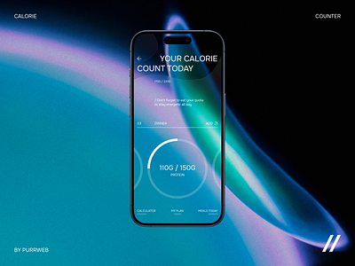
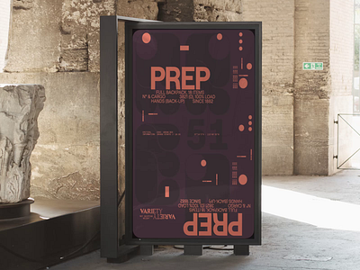
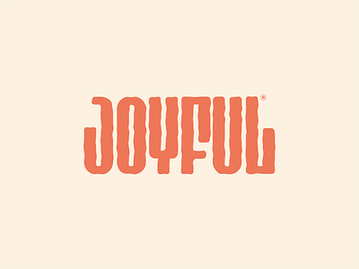
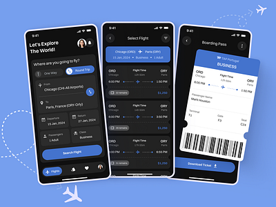
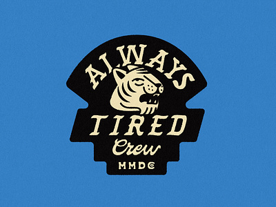
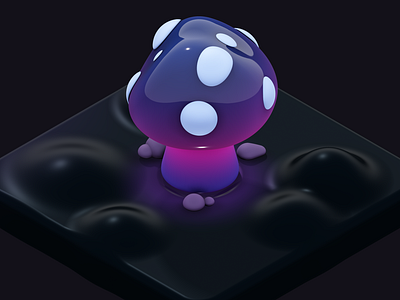
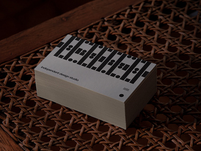
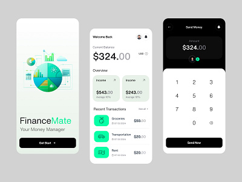

## index.html
```
<!DOCTYPE html>
<html lang="en">
<head>
    <meta charset="UTF-8">
    <meta name="viewport" content="width=device-width, initial-scale=1.0">
    <title>Dribbble</title>
    <link rel="stylesheet" href="styles.css">
    
</head>
<body>
    <header>
        <div class="head">
            <h1>Dribbble</h1>
        </div>
        <div class="menu">
            <nav>
                <ul>
                    <li><a href="#">Home</a></li>
                    <li><a href="#">Designers</a></li>
                    <li><a href="#">Team</a></li>
                    <li><a href="#">Community</a></li>
                    <li><a href="#">Jobs</a></li>
                    <li><a href="#">...</a></li>
                </ul>
            </nav>
        </div>
        <div class="sign">
            <nav>
                <ul>
                    <li><a href="#">Sign up</a></li>
                    <li><a href="#">Sign in</a></li>
                </ul>
            </nav>
        </div>
        <div class="search-container">
            <form action="/search" method="GET">
                <input type="text" name="query" placeholder="Search...">
            </form>
        </div>
    </header>
        <div class="learn">
            <p class="first">What are you working on?</p>
            <p class="second"> Dribbble is show and tell for designers. </p>
            <button class="btn"> Learn more</button>
            <button class="btn2"> Sign up</button>
        </div>
        <section class="section1">
            <div>
                <select class="selector1">
                    <option value="option1">Popular</option>
                </select>
                <select class="selector2">
                    <option value="option1">Shots</option>
                </select>
                <select class="selector3">
                    <option value="option1">Now</option>
                </select>
            </div>
        </section>
        <section class="shots">
            <div class="shot">
                
                <p>Famous</p>
            </div>
            <div class="shot">
                
                <p>Balkan Brothers</p>
            </div>
            <div class="shot">
                
                <p>Jan Losert</p>
            </div>
            <div class="shot">
                
                <p>Mattias Johansson</p>
            </div>
            <div class="shot">
                
                <p>Ruslan Siiz</p>
            </div>
            <div class="shot">
                
                <p>Paperpillar</p>
            </div>
            <div class="shot">
                
                <p>Alfrey Davilla | vaneltia</p>
            </div>
            <div class="shot">
                
                <p>A Studio-JQ Δ</p>
            </div>
            <div class="shot">
                
                <p>RomainTrystram</p>
            </div>
            <div class="shot">
                
                <p>inFullMobile</p>
            </div>
            <div class="shot">
                
                <p>FourPlus Studio</p>
            </div>
            <div class="shot">
                
                <p>MUTI</p>
            </div>
            
        </section>
           
</body>
</html>
```
## styles.css
```
body {
    font-family: Arial, sans-serif;
    margin: 0;
    padding: 0;
    background-color: #f8f8f8;
}

header {
    display: flex;
    justify-content: space-between;
    align-items: center;
    padding: 20px;
    background-color: #342d2d;
    width: 100%;
    box-sizing: border-box;
}

.head {
    display: flex;
    align-items: center;
    justify-content: left;
    color: #f8f8f8;
}

.head h1 {
    font-style: italic;
    font-family: 'Gill Sans', 'Gill Sans MT', Calibri, 'Trebuchet MS', sans-serif;
}

nav ul {
    list-style-type: none;
    margin: 0;
    padding: 0;
    display: flex;
}

nav ul li {
    margin-right: 20px;
}

nav ul li a {
    text-decoration: none;
    font-weight: bold;
    color: #9f8f8f;
}

nav ul li a:hover {
    color: #f8f8f8;
}

.sign {
    font-size: 18px;
    margin-left: 150px;
}

.menu {
    font-size: 18px;
    margin-right: 250px;
}

.search-container input[type="text"] {
    padding: 10px 20px;
    font-size: 18px;
    border-radius: 11px;
}

.learn {
    background-color: #171111bf;
    display: flex;
    align-items: center;
    padding: 10px;
    font-weight: bold;
    font-size: large;
    text-align: center;
    justify-content: center;
}

.learn .first {
    color: #f8f8f8;
}

.learn .second {
    color: #9f8f8f;
}

.learn .btn, .learn .btn2 {
    background-color: #e3dfdf66;
    color: white;
    cursor: pointer;
    display: inline-block;
    border-radius: 11px;
    padding: 20px 20px;
    font-weight: bold;
    font-size: medium;
    margin: 2px;
}

.learn .btn2 {
    background-color: rgb(233, 86, 162);
    color: #f8f8f8;
}

.section1 {
    display: flex;
    justify-content: center;
    background-color: #f8f8f8;
    padding: 5px ;
}

.section1 select {
    padding: 10px;
    border: none;
    background-color: #f8f8f8;
    font-size: medium;
    font-weight: bold;
    margin: 0 10px;
}

.shots {
    display: flex;
    flex-wrap: wrap;
    justify-content: center;
    padding: 20px;
    background-color: rgb(218, 236, 236);
    width: 100%;
    box-sizing: border-box;
}

.shot {
    background-color: #fff;
    border: 1px solid #ddd;
    margin: 10px;
    padding: 10px;
    width: 300px; /* Adjusted to fit 100% screen width when wrapped */
    text-align: center;
    box-shadow: 0 0 10px rgba(0, 0, 0, 0.1);
}

.shot img {
    max-width: 100%;
    height: auto;
}

.shot p {
    margin: 10px 0 0;
    font-size: large;
    font-weight: bolder;
}
```
## OUTPUT

